# Mermaid チートシート

## 基本

```markdown
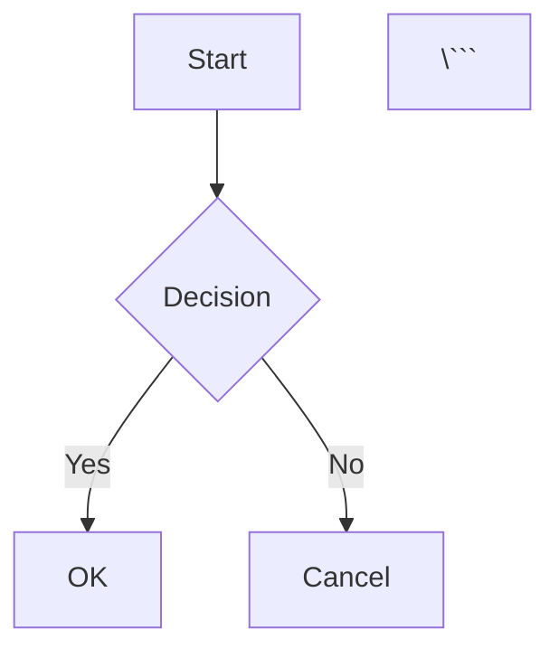

## フローチャート

### 基本構文

````markdown
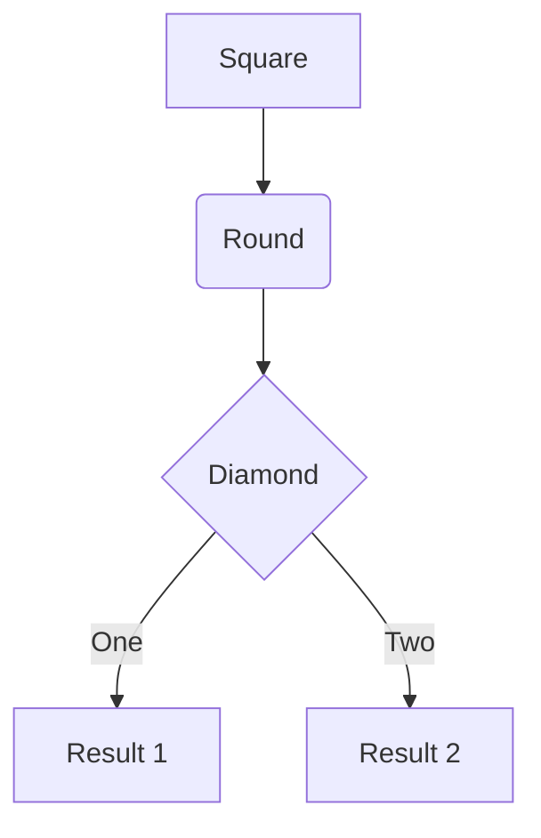
````

### ノードの形状

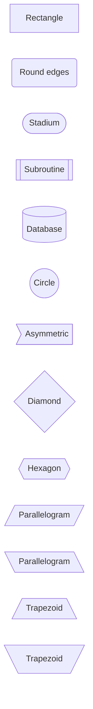

### 方向

```mermaid
flowchart TB  %% Top to Bottom
flowchart TD  %% Top Down（TBと同じ）
flowchart BT  %% Bottom to Top
flowchart RL  %% Right to Left
flowchart LR  %% Left to Right
```

### 矢印の種類

```mermaid
flowchart LR
    A --> B    %%  実線矢印
    C -.-> D   %%  点線矢印
    E ==> F    %%  太線矢印
    G -- text --> H    %%  テキスト付き
    I -.text.-> J      %%  点線でテキスト付き
    K ==text==> L      %%  太線でテキスト付き
    M --> N & O        %%  複数の接続先
    P & Q --> R        %%  複数の接続元
```

### サブグラフ

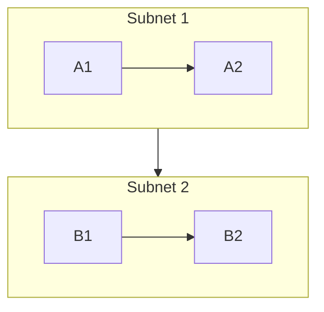

## シーケンス図

### 基本構文

````markdown
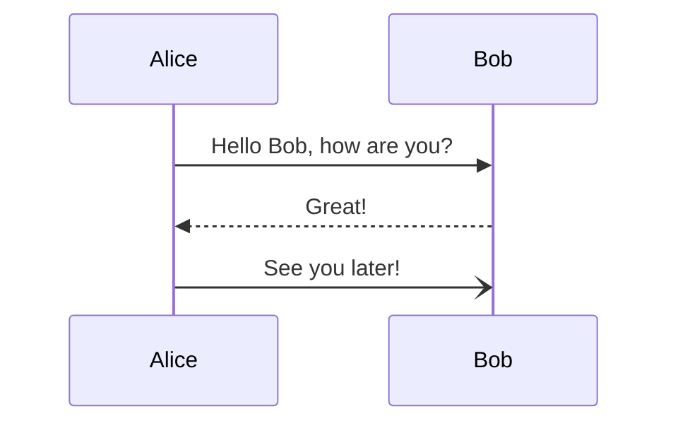
````

### メッセージタイプ

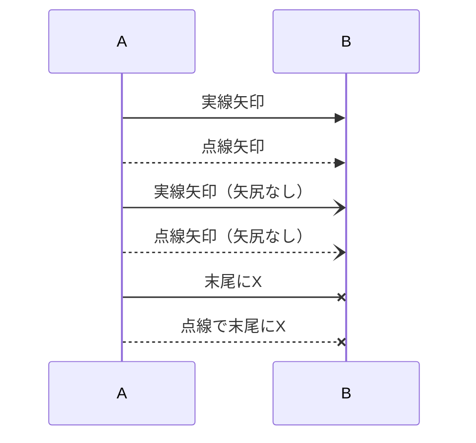

### アクティベーション

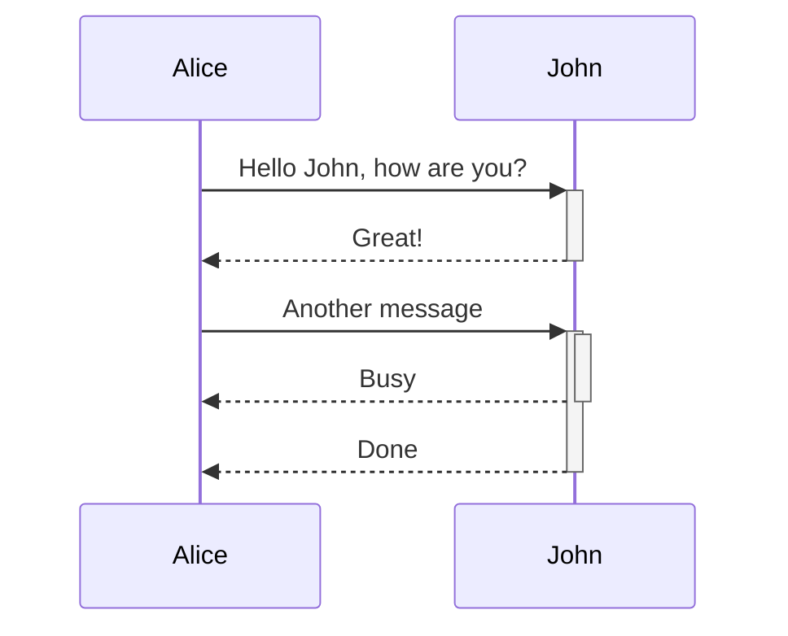

### ノート

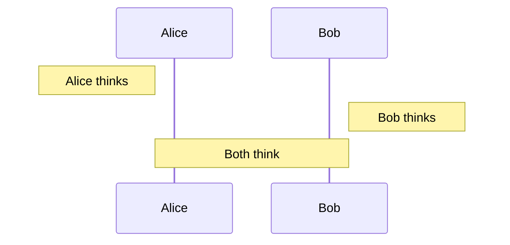

### ループ・条件分岐

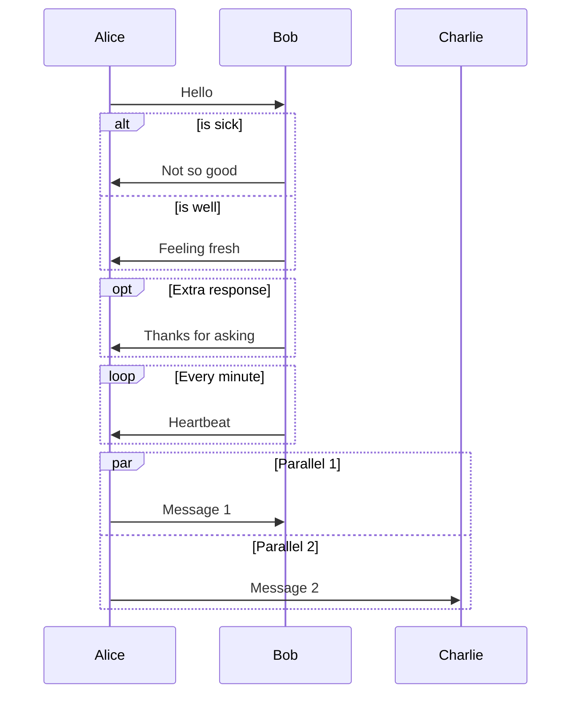

## クラス図

### 基本構文

````markdown
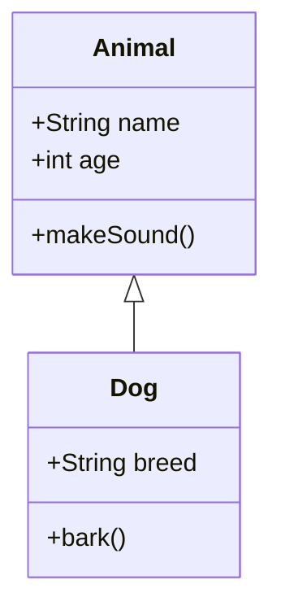
````

### 関係性

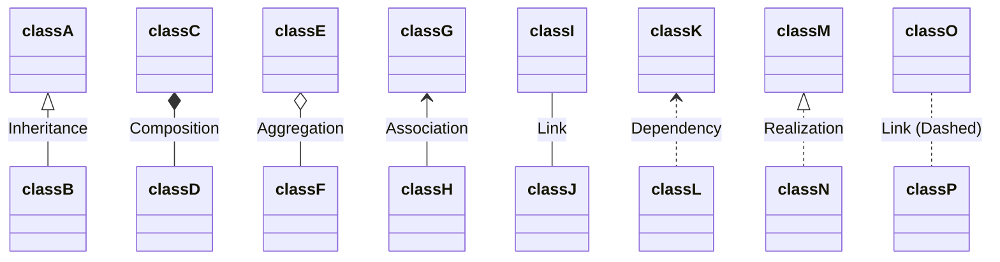

### 可視性

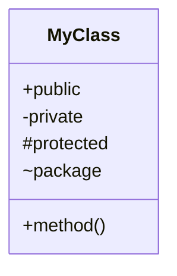

### メソッド・プロパティ

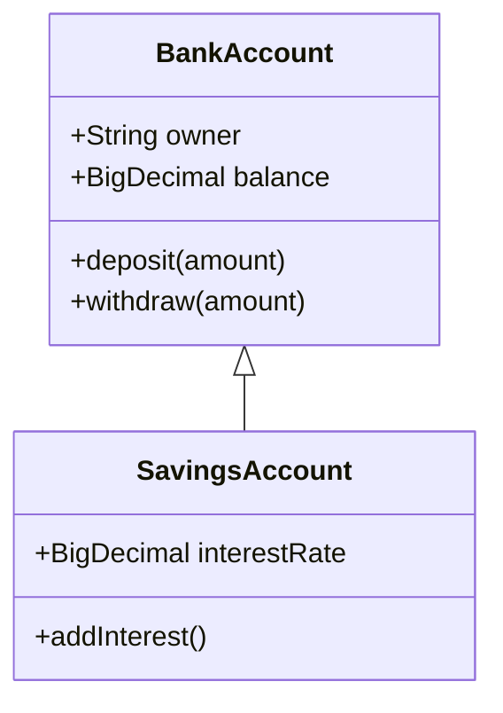

## 状態図

### 基本構文

````markdown
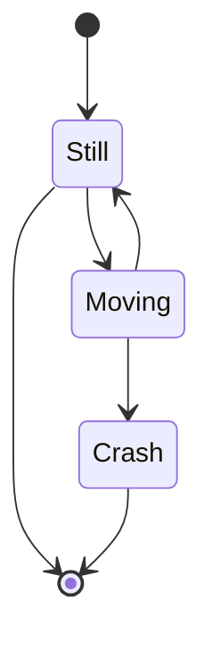
````

### 複合状態

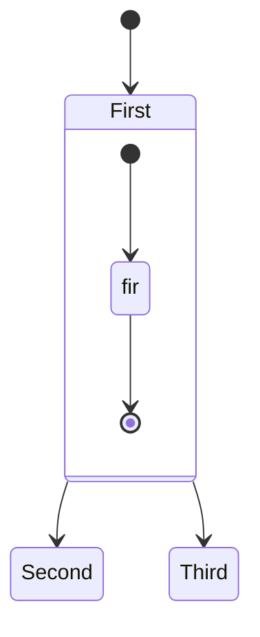

### 選択

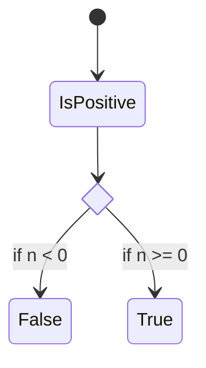

## ER図（Entity Relationship）

````markdown
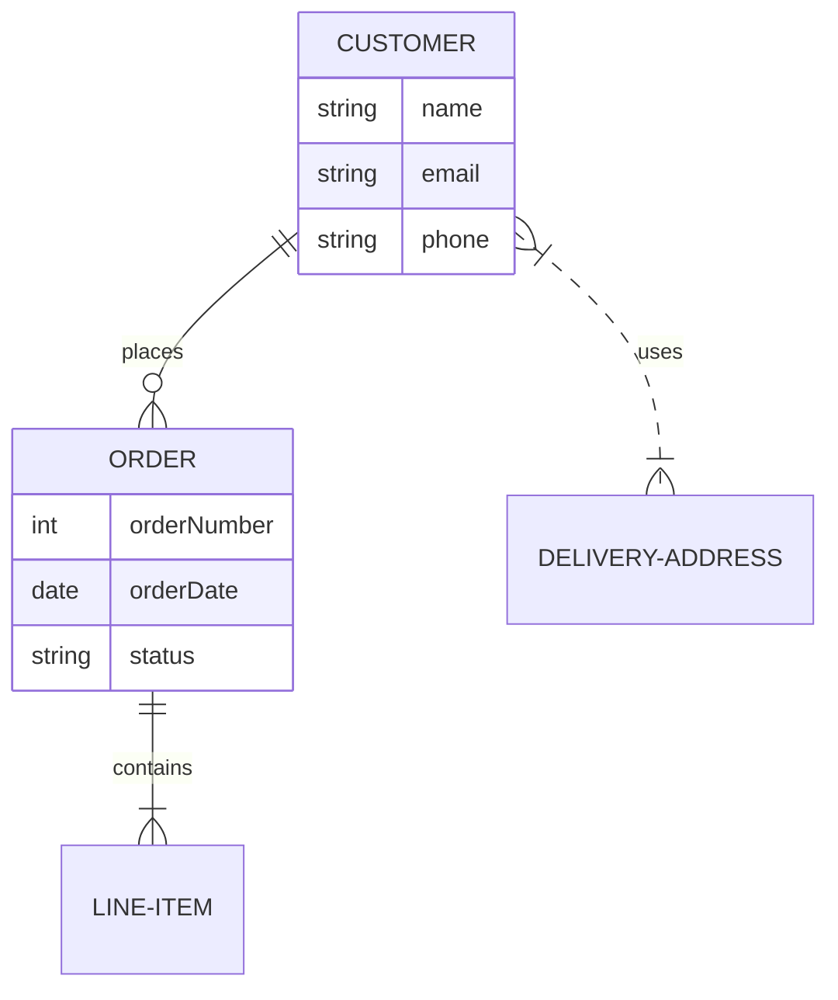
````

### 関係性

```
||--||  : One to one
||--o{  : One to many
}o--o{  : Many to many
||--|{  : One to one or many
}|..|{  : Many to many (dotted)
```

## ガントチャート

````markdown
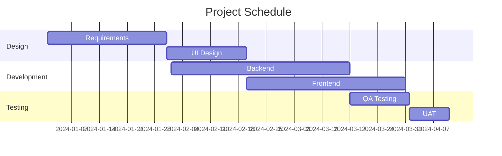
````

### タスクのステータス

```mermaid
gantt
    title Task Status
    dateFormat YYYY-MM-DD
    section Tasks
    Completed task      :done, task1, 2024-01-01, 2024-01-15
    Active task         :active, task2, 2024-01-10, 30d
    Future task         :task3, 2024-02-01, 20d
    Critical task       :crit, task4, 2024-01-20, 25d
```

## パイチャート

````markdown
```mermaid
pie title Pets
    "Dogs" : 45
    "Cats" : 30
    "Birds" : 15
    "Fish" : 10
```
````

## ユーザージャーニー

````markdown
```mermaid
journey
    title My working day
    section Go to work
      Make tea: 5: Me
      Go upstairs: 3: Me
      Do work: 1: Me, Cat
    section Go home
      Go downstairs: 5: Me
      Sit down: 5: Me
```
````

## Gitグラフ

````markdown
```mermaid
gitGraph
    commit
    commit
    branch develop
    checkout develop
    commit
    commit
    checkout main
    merge develop
    commit
    commit
```
````

### カスタマイズ

```mermaid
gitGraph
    commit id: "Initial"
    commit id: "Add feature" tag: "v1.0"
    branch develop
    checkout develop
    commit id: "Dev work"
    checkout main
    merge develop
    commit id: "Hotfix" type: REVERSE
```

## マインドマップ

````markdown
```mermaid
mindmap
  root((Project))
    Planning
      Requirements
      Design
    Development
      Backend
      Frontend
      Database
    Testing
      Unit Tests
      Integration Tests
      E2E Tests
    Deployment
      CI/CD
      Monitoring
```
````

## タイムライン

````markdown
```mermaid
timeline
    title History of Social Media
    2002 : LinkedIn
    2004 : Facebook
         : Google
    2005 : Youtube
    2006 : Twitter
    2010 : Instagram
```
````

## スタイリング

### クラススタイル

```mermaid
flowchart LR
    A:::someclass --> B
    B --> C:::someclass
    classDef someclass fill:#f96,stroke:#333,stroke-width:4px
```

### ノードスタイル

```mermaid
flowchart LR
    id1(Start)-->id2(Stop)
    style id1 fill:#f9f,stroke:#333,stroke-width:4px
    style id2 fill:#bbf,stroke:#f66,stroke-width:2px,stroke-dasharray: 5 5
```

### テーマ

````markdown
```mermaid
%%{init: {'theme':'dark'}}%%
graph TD
    A-->B
```

```mermaid
%%{init: {'theme':'forest'}}%%
graph TD
    A-->B
```

```mermaid
%%{init: {'theme':'neutral'}}%%
graph TD
    A-->B
```
````

## 実践例

### システムアーキテクチャ

````markdown
```mermaid
flowchart TB
    subgraph Client
        Web[Web Browser]
        Mobile[Mobile App]
    end

    subgraph AWS
        subgraph VPC
            ALB[Application Load Balancer]
            subgraph Private
                ECS[ECS Fargate]
                RDS[(RDS PostgreSQL)]
            end
        end
        S3[(S3 Bucket)]
        CloudFront[CloudFront CDN]
    end

    Web --> CloudFront
    Mobile --> CloudFront
    CloudFront --> S3
    CloudFront --> ALB
    ALB --> ECS
    ECS --> RDS
    ECS --> S3
```
````

### APIシーケンス

````markdown
```mermaid
sequenceDiagram
    participant Client
    participant API
    participant Auth
    participant DB

    Client->>+API: POST /login
    API->>+Auth: Validate credentials
    Auth->>+DB: Query user
    DB-->>-Auth: User data
    Auth-->>-API: JWT token
    API-->>-Client: 200 OK + token

    Client->>+API: GET /users (with token)
    API->>+Auth: Verify token
    Auth-->>-API: Valid
    API->>+DB: Fetch users
    DB-->>-API: User list
    API-->>-Client: 200 OK + data
```
````

### データベース設計

````markdown
```mermaid
erDiagram
    USER ||--o{ ORDER : places
    USER {
        int id PK
        string email UK
        string name
        datetime created_at
    }
    ORDER ||--|{ ORDER_ITEM : contains
    ORDER {
        int id PK
        int user_id FK
        decimal total
        string status
        datetime created_at
    }
    PRODUCT ||--o{ ORDER_ITEM : "ordered in"
    ORDER_ITEM {
        int id PK
        int order_id FK
        int product_id FK
        int quantity
        decimal price
    }
    PRODUCT {
        int id PK
        string name
        string description
        decimal price
        int stock
    }
```
````

### CI/CDパイプライン

````markdown
```mermaid
flowchart LR
    A[Git Push] --> B{Run Tests}
    B -->|Pass| C[Build Docker Image]
    B -->|Fail| Z[Notify Failure]
    C --> D[Push to Registry]
    D --> E{Environment}
    E -->|Dev| F[Deploy to Dev]
    E -->|Staging| G[Deploy to Staging]
    E -->|Prod| H[Deploy to Production]
    F --> I[Run E2E Tests]
    G --> I
    H --> I
    I -->|Success| J[Complete]
    I -->|Failure| K[Rollback]
```
````

## Tips

```markdown
# コメント
%% これはコメントです

# 改行
<br>を使用

# リンク
click nodeId "https://example.com" "Tooltip"

# アイコン（Font Awesome）
flowchart TD
    A[fa:fa-user User]

# 設定
%%{init: {
  'theme': 'dark',
  'themeVariables': {
    'primaryColor': '#BB2528',
    'primaryTextColor': '#fff'
  }
}}%%
```

## プラットフォーム対応

- GitHub: ネイティブサポート
- GitLab: ネイティブサポート
- Notion: サポート
- VSCode: プラグイン必要
- Obsidian: プラグイン必要

## オンラインエディタ

- [Mermaid Live Editor](https://mermaid.live/)
- [Mermaid Chart](https://www.mermaidchart.com/)
